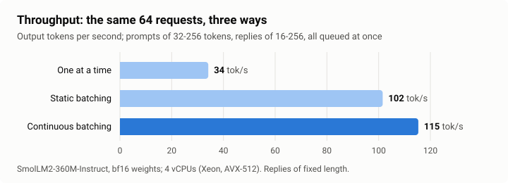
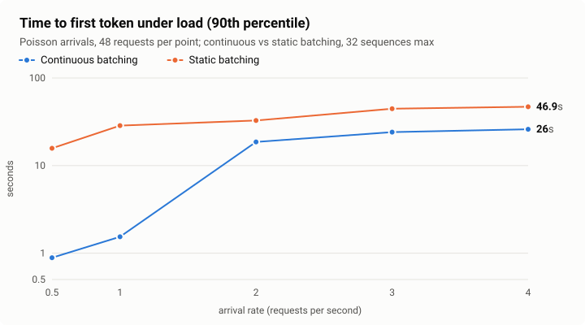
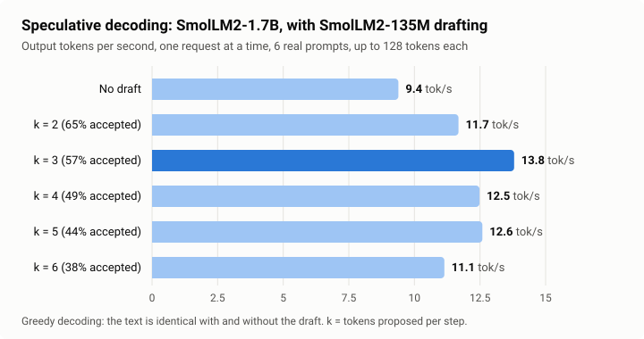
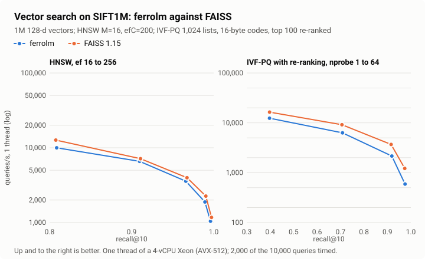
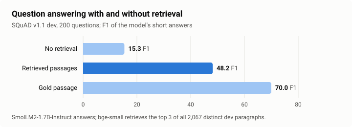

# ferrolm

An LLM inference server written from scratch in Rust, with no dependencies.
It loads Hugging Face checkpoints (SmolLM2, Llama, Qwen2) and serves an
OpenAI-compatible API, with the techniques production servers such as vLLM
use: a **paged KV cache**, **continuous batching**, **prefix caching** and
**speculative decoding**, on hand-written **AVX-512 / AVX2** kernels.

It also implements the rest of a retrieval-augmented (RAG) stack:
**int8/int4 weight quantization** with activation-aware scaling (AWQ), a
**BERT embedding model** served at `/v1/embeddings`, **vector search**
(exact, HNSW and IVF-PQ) benchmarked against FAISS, and a retrieval
pipeline evaluated on BEIR and SQuAD.

Its outputs are checked against Hugging Face transformers, and every
serving optimisation is tested to leave a request's output bit for bit
unchanged.

On a 4-vCPU machine, with real model weights:

| Technique | Measured effect |
|---|---|
| Continuous batching vs one request at a time | **3.4×** throughput (115 vs 34 tokens/s) |
| Continuous vs static batching, at 0.5 requests/s | first token **18× sooner** (0.54 s vs 9.55 s, median) |
| Paged vs reserved KV cache, same 256 MB | **20 sequences at once instead of 1**, 2.4× throughput |
| Prefix caching, shared 512-token system prompt | first token **46× sooner** (0.33 s vs 15.3 s, median) |
| Speculative decoding, SmolLM2-1.7B + 135M draft | **1.47×** single-stream speed, identical text |
| int8 weights vs bf16, SmolLM2-360M | same perplexity (19.92 vs 19.93), **38% less memory**, 1.23× decode speed |
| int4 with AWQ scaling vs plain int4 | recovers **half** the perplexity int4 loses; 1.86× decode speed of bf16 (1.7B) |
| HNSW and IVF-PQ vs FAISS 1.15, SIFT1M (1M vectors) | **same recall**; single-thread speed 77-95% of FAISS (HNSW), 59-89% (IVF-PQ) |
| bge-small embeddings, BEIR SciFact | nDCG@10 **0.7118** (transformers on the same data: 0.7127) |
| Retrieval-augmented answers, SQuAD, SmolLM2-1.7B | F1 **15.3 → 48.2** with 3 retrieved passages (gold passage: 70.0) |

## Results

All runs: `bench/run.sh`, raw numbers in `bench/results/`. Machine: 4 vCPUs
of an Intel Xeon (Cascade Lake, AVX-512), 15 GB RAM. Models in bf16. The
load generator sends prompts of random tokens with fixed reply lengths
(except for speculative decoding, which needs real text), and records when
every token arrives.

### Continuous batching



The same 64 requests (prompts of 32 to 256 tokens, replies of 16 to 256),
queued at once, on SmolLM2-360M:

| Scheduling | Output tok/s | First token, median | Finished, median |
|---|---|---|---|
| One request at a time | 34.1 | 134.1 s | 137.9 s |
| Static batching (up to 32 per batch) | 101.5 | 26.1 s | 57.7 s |
| Continuous batching (up to 32 running) | **115.3** | **15.4 s** | 60.2 s |

Batching wins because decoding one token reads every weight once; a batch
reads them once for all its sequences. Continuous batching adds more when
requests arrive over time, because static batching makes new requests wait
for the whole current batch to finish:



| Arrivals/s | Static: first token p50 / p90 | Continuous: p50 / p90 | Static tok/s | Continuous tok/s |
|---|---|---|---|---|
| 0.5 | 9.55 s / 15.8 s | **0.54 s / 0.89 s** | 74.9 | 82.5 |
| 1 | 15.1 s / 28.6 s | **0.75 s / 1.54 s** | 89.3 | 109.4 |
| 2 | 30.3 s / 32.7 s | **3.17 s / 18.6 s** | 93.2 | 110.3 |
| 3 | 13.6 s / 44.6 s | **5.61 s / 24.1 s** | 94.6 | 112.5 |
| 4 | 13.9 s / 46.9 s | **7.12 s / 26.0 s** | 99.2 | 118.6 |

This CPU saturates at about 0.7 requests/s for this workload, so from
2 requests/s on both queue up; continuous batching still answers first and
serves more.

### Paged KV cache

With 256 MB for keys and values (204 blocks, 3,264 tokens of SmolLM2-360M), reserving
a 2,048-token window per sequence, as a server without paging must, fits
one sequence at a time. Allocating 16-token blocks as sequences grow fits
many:

| KV cache, 256 MB | Most sequences at once | Output tok/s |
|---|---|---|
| Reserve 2,048 tokens per sequence | 1 | 34.6 |
| Paged, 16-token blocks | **20** | **83.8** (2.4×) |

When the paged cache filled up, the scheduler preempted and later
recomputed sequences 42 times; every request still completed.

### Prefix caching

32 requests, one per second, all starting with the same 512-token system
prompt:

| | First token p50 / p90 | Finished, median | Prompt tokens from cache |
|---|---|---|---|
| No prefix cache | 15.3 s / 32.3 s | 48.0 s | 0 |
| Prefix cache | **0.33 s / 0.63 s** | **2.9 s** | 15,872 |

Without the cache every request recomputes the system prompt and the
server falls behind; with it, each request after the first computes only
its own few tokens.

### Speculative decoding



SmolLM2-1.7B answering six real instructions (the first six in
`bench/prompts.txt`, up to 128 tokens each) one at a time, with
SmolLM2-135M proposing `k` tokens per step. Under greedy decoding the text is identical with and without the
draft (tested), so the speedup is free. The best `k` here is 3: **13.8 vs
9.4 tokens/s**. Longer proposals are accepted less often and waste draft
work.

Speculation pays only when the target is memory-bound. With 8 sequences
batched, the target is already compute-bound and the draft's extra work
makes it slower: 26.9 tokens/s with a draft (k = 4) vs 30.4 without.

### Quantization

The transformer layers' weights in int8 or int4, in groups of 32 with one
f32 scale each, dequantized inside the matrix-multiply kernel
(`bench/quant.sh`). Perplexity of SmolLM2-360M on WikiText-2 (20 windows of
512 tokens, 10,220 tokens scored), and single-stream decode speed (128
tokens):

| Weights | Size (360M) | Perplexity | Decode, 360M | Decode, 1.7B |
|---|---|---|---|---|
| bf16 | 724 MB | 19.93 | 50.9 tok/s | 11.9 tok/s |
| int8 | 448 MB | **19.92** | 62.5 tok/s | 16.9 tok/s |
| int4 | 291 MB | 23.61 | 91.2 tok/s | 22.1 tok/s |
| int4 + AWQ scaling | 291 MB | **21.78** | as int4 | as int4 |

int8 costs nothing measurable in quality. int4 does, and activation-aware
scaling recovers half of the lost perplexity (23.61 → 21.78) at no cost in
size or speed. Decoding one stream reads every weight once per token, so
smaller weights decode faster: int4 decodes the 1.7B model 1.86× faster
than bf16.

### Vector search



SIFT1M (1 million 128-dimensional vectors, 10,000 queries), with FAISS 1.15
given identical parameters on the same machine (`bench/ann.sh`); queries per
second on one thread:

| Index | Setting | ferrolm recall@10 | FAISS recall@10 | ferrolm QPS | FAISS QPS |
|---|---|---|---|---|---|
| HNSW (M=16, efC=200) | ef = 64 | 0.9666 | 0.9675 | 4,476 | 5,248 |
| | ef = 128 | 0.9899 | 0.9904 | 2,366 | 3,056 |
| | ef = 256 | 0.9967 | 0.9974 | 1,311 | 1,541 |
| IVF-PQ (1,024 lists, 16-byte codes) | nprobe = 16 | 0.5553 | 0.5513 | 4,343 | 5,841 |
| + exact re-ranking of the top 100 | nprobe = 16 | 0.9190 | 0.9159 | 3,829 | 4,310 |
| | nprobe = 64 | 0.9753 | 0.9741 | 1,285 | 1,514 |

Recall matches FAISS at every setting. On one thread, ferrolm's HNSW runs
at 77-95% of FAISS's speed and builds in about the same time (126 s vs
120 s on 4 threads); its IVF-PQ runs at 59-89%, furthest behind when few
lists are probed and the scan of the compressed codes dominates, which
FAISS has tuned further. All of these numbers come from one run of
`bench/ann.sh`: on this shared virtual machine, absolute speeds moved by up
to 40% between sessions, so only numbers from the same run are compared.
Raw results for every setting: `bench/results/ann.jsonl`.

### Embeddings and retrieval

bge-small-en-v1.5 (33M parameters) embeds the 5,183 abstracts of BEIR
SciFact; the 300 test claims are embedded with bge's query instruction and
matched by cosine similarity (`bench/rag.sh`):

| Search | nDCG@10 | recall@100 | top-10 agreement with exact search |
|---|---|---|---|
| Exact | **0.7118** | 0.9417 | 1 |
| HNSW, ef = 32 | 0.7119 | 0.9417 | 0.9980 |
| HNSW, ef = 128 | 0.7118 | 0.9450 | 0.9997 |
| HNSW, ef = 512 | 0.7118 | 0.9417 | 0.9997 |

Exact search gives nDCG@10 **0.7118**; transformers in float32 with the
same data and metric gives **0.7127** (recall@100: 0.9417 for both). HNSW
returns the same ranking for 99.97% of top-10 results at ef = 128, so it
loses nothing measurable here (its recall@100 can even edge past exact
search, by how ties at rank 100 fall). Embedding runs at 2,805
tokens/s on the 4 vCPUs, 58% of PyTorch's speed on the same machine
(4,862 tokens/s).

### Retrieval-augmented answers



SmolLM2-1.7B-Instruct answers 200 random questions from the SQuAD v1.1 dev
set (greedy decoding, one invented worked example in the prompt to show the
answer format), three ways: with no passages, with the 3 passages bge-small
retrieves from all 2,067 distinct dev paragraphs, and with the gold
paragraph as an upper bound. Answers are scored with SQuAD's official
normalisation:

| Context given to the model | Exact match | F1 | Prompt tokens |
|---|---|---|---|
| None (closed book) | 5.0 | 15.3 | 96 |
| 3 retrieved passages | **37.0** | **48.2** | 690 |
| The gold paragraph | 54.5 | 70.0 | 342 |

Retrieval puts the gold paragraph in the top 3 for 167 of the 200
questions (83.5%) and takes F1 from 15.3 to 48.2, 60% of the way to the
gold-paragraph bound. A model this small still sometimes answers in a full
sentence, which costs exact match more than F1.


### Kernels

A single decode step of SmolLM2-360M (one sequence) takes about 26 ms and
of SmolLM2-1.7B about 103 ms, which is streaming the bf16 weights at
roughly 30 GB/s. The matrix multiply reaches 310 to 340 GFLOPS on
prefill-sized batches with AVX-512 on the 4 vCPUs (`examples/gemm.rs`).

## Correctness

A fast server that returns different text is a broken server, so every
optimisation here is checked against a reference or an invariant, and CI
runs the checks on every push.

| Check | Against | Result |
|---|---|---|
| Logits for a 50-token prompt | Hugging Face transformers (float32), on SmolLM2-135M, SmolLM2-360M and Qwen2.5-0.5B | max difference 6e-5 to 3.5e-4 (largest logit 22 to 31) |
| 32 greedy tokens | transformers `generate()` | identical, all three models |
| Three fixture architectures (Llama with GQA; Llama 3 with tied embeddings and RoPE scaling; Qwen2 with q/k/v biases) | transformers, random weights | max difference < 1.4e-5; 40 greedy tokens identical |
| Tokenizer ids | Hugging Face `tokenizers`: SmolLM2-, Llama 3- and Qwen2-style tokenizers on 2,026 multilingual and random-Unicode strings each, plus the real tokenizers on 1,026 each | identical |
| Chat prompts | transformers `apply_chat_template` | identical strings |
| Batching, chunked prefill, static vs continuous admission | the same request run alone | bit-identical tokens |
| Prefix-cache hits, preemption and recompute | the same request run alone | bit-identical tokens |
| Speculative decoding, greedy (a one-layer draft, and the target as its own draft; k = 1, 3, 4) | the target model alone | bit-identical tokens |
| Speculative sampling | the exact two-token distribution of the target | chi-square 19.9 on 15 degrees of freedom (limit 37.7) |
| SIMD kernels | the portable scalar path | bit-identical results |
| int8/int4 kernels | the same weights dequantized, run through the f32 path; SIMD vs portable | bit-identical; batch-invariant |
| AWQ scaling | the unscaled model in full precision | the folded scales leave the function unchanged; quantization error falls on held-out inputs |
| WordPiece tokenizer | Hugging Face `tokenizers`, bge-small and a trained fixture vocabulary, 526 multilingual and random-Unicode strings each | identical ids |
| BERT embeddings | transformers (float32): bge-small-en-v1.5 and a random-weight fixture | cosine similarity >= 0.99999 |
| Embedding batches | the same text embedded alone | bit-identical vector |
| HNSW, IVF-PQ | exact search, clustered random data (L2 and inner product); save/load round trip | recall >= 0.98 (HNSW, ef 128); IVF-PQ recall rises with nprobe and re-ranking |
| Parallel HNSW build | exact search, 5,000 unit vectors sharing a common direction (like text embeddings) | graph connected; recall@10 >= 0.999 |

The "bit-identical" rows rest on one design rule, below.

## Design

**Batch-invariant kernels.** Every output of the matrix multiply is a single
chain of fused multiply-adds over the inner dimension, in order, from zero.
Tiling only decides which chains run side by side in registers, never the
order inside a chain. Attention and the norms reduce in fixed orders too. So
a token's logits do not depend on what else is in the batch, how its prompt
was chunked, the thread count or the instruction set: AVX-512, AVX2 and the
portable path agree bit for bit. That turns "does batching change the
output?" from a tolerance question into an equality test, and it is also
why greedy speculative decoding reproduces the target's text exactly.

**Kernels.** Weights stay in bf16 and are packed at load time into panels of
32 output rows, so the kernel streams them sequentially and widens bf16 to
f32 with two shuffles. Register tiles go up to 8 rows × 32 columns
(AVX-512) or 3 × 32 (AVX2), with the inner dimension blocked for the L1
cache. Attention is fused per kv head, so grouped-query heads share each
key/value load. A persistent thread pool with spinning workers keeps the
hundreds of small jobs in a decode step cheap.

**Paged KV cache.** The cache is a pool of 16-token blocks and each sequence
owns a block table, so memory is committed as tokens arrive instead of
reserved for the longest possible sequence. Within a block each kv head's
keys are contiguous.

**Prefix caching.** Full blocks are content-addressed by a hash chained over
the whole prefix. A new request reuses cached leading blocks (checked
token by token, so a hash collision cannot serve wrong data), blocks are
reference counted, and idle cached blocks are evicted least recently used.

**Scheduler.** Each step packs running sequences' decode tokens and chunks of
new prompts into one batch under a token budget, so long prompts never stall
decoding and requests join and leave at every step. When the cache is full,
the most recently admitted sequence is preempted and later recomputed.
Static (request-level) admission and whole-sequence reservation are kept as
switches, for the baselines.

**Speculative decoding.** A small draft model proposes k tokens per sequence;
the target scores all of them in one batched pass and keeps the longest
agreeing prefix plus one token of its own. Under sampling, proposals are
accepted with probability min(1, p/q) and rejections resample from the
residual, which preserves the target distribution.

**Quantization.** Weights are quantized per output row in groups of 32
inputs, symmetric, with one f32 scale per group chosen by searching
clipping ratios for the least squared error. Codes stay in the same
32-row panels as bf16 weights, so the kernel loads 32 int8 codes (or 16
bytes of int4 pairs), widens them to f32 in registers and multiplies by
the group's scale. Each group's partial sum is its own fixed chain of
fused multiply-adds, which keeps the kernels batch-invariant.
Activation-aware scaling (AWQ) runs calibration text through the model,
records the mean magnitude of each input channel of every projection,
and searches a per-channel scale s = mean|x|^α (α from 0 to 1) that
minimises the quantized layer's output error on those activations. The
weights are multiplied by s before rounding and the inverse is folded
into whatever produces the input: the RMSNorm weight for q/k/v and
gate/up, the up-projection rows for down, the v rows for o.

**Embeddings.** The BERT encoder runs the texts of a request as one
packed batch with no padding: matrix multiplies cover all tokens, and
attention stays inside each text, which also makes a text's vector
independent of its batch. The WordPiece tokenizer reproduces Hugging
Face's BertNormalizer exactly (its control, whitespace, punctuation and
accent tables are probed from the `tokenizers` library, with NFD and CJK
handling), then greedy longest-match WordPiece.

**Vector search.** HNSW follows Malkov and Yashunin with FAISS's choices
(2M links on layer 0, the neighbour-diversity heuristic), built in
parallel with per-node locks. IVF-PQ quantizes each vector's residual
from its k-means cell with 16 sub-quantizers of 256 codewords, scores
candidates with lookup tables (precomputed per cell for L2, as FAISS
does) and can re-rank the best candidates exactly.

**Everything else from scratch.** safetensors loading, a byte-level BPE
tokenizer with hand-written pre-tokenizer matchers and Unicode NFC, JSON,
HTTP/1.1 with server-sent events, Prometheus metrics. No crates.

## Usage

```sh
cargo build --release
scripts/fetch_model.sh HuggingFaceTB/SmolLM2-360M-Instruct models/smollm2-360m

# OpenAI-compatible server
./target/release/ferrolm serve --model models/smollm2-360m --port 8000
curl localhost:8000/v1/chat/completions -H 'Content-Type: application/json' \
  -d '{"messages":[{"role":"user","content":"What is the capital of France?"}],"stream":true}'

# One prompt from the command line, optionally with a draft model
./target/release/ferrolm generate --model models/smollm2-1.7b --draft models/smollm2-135m \
  --chat --prompt "Explain recursion." --max-tokens 200

# Load test
./target/release/ferrolm bench --model models/smollm2-360m --requests 64 --rate 2
```

```sh
# Quantized weights (int8, or int4 with activation-aware scaling)
./target/release/ferrolm serve --model models/smollm2-1.7b --quant int8
./target/release/ferrolm perplexity --model models/smollm2-360m --data data/wikitext2-test.txt \
  --quant int4 --awq --calib data/wikitext2-train.txt

# Embeddings next to a chat model
scripts/fetch_model.sh BAAI/bge-small-en-v1.5 models/bge-small
./target/release/ferrolm serve --model models/smollm2-360m --embedding-model models/bge-small
curl localhost:8000/v1/embeddings -H 'Content-Type: application/json' \
  -d '{"input":["What is the capital of France?","Paris is in France."]}'

# Retrieval and RAG evaluation (bench/rag.sh), vector search (bench/ann.sh)
./target/release/ferrolm retrieval --encoder models/bge-small --beir data/scifact \
  --query-prefix "Represent this sentence for searching relevant passages: "
```

Endpoints: `POST /v1/completions`, `POST /v1/chat/completions` (streaming,
`stop`, `seed`, `temperature`, `top_p`, `top_k`), `GET /v1/models`,
`POST /v1/embeddings` (with `--embedding-model`; float or base64),
`GET /health`, `GET /metrics`. Engine options (`--kv-mem`,
`--max-batch-tokens`, `--max-seqs`, `--spec-k`, ...) are listed by
`ferrolm help`.

Checkpoints: Llama-architecture models and Qwen2/2.5 in bf16, f16 or f32
safetensors, with byte-level BPE tokenizers. Tested on real weights:
SmolLM2-135M/360M/1.7B-Instruct and Qwen2.5-0.5B-Instruct. Llama 3 features
(tied embeddings, llama3 RoPE scaling, its tokenizer pattern and chat
format) are covered by fixture tests; Mistral-style configs without sliding
windows load but are untested.

## Limitations

- CPU only; weights are bf16, int8 or int4 with f32 activations and an f32
  KV cache. Quantized weights are made at load time (no saved quantized
  checkpoints), and the embeddings and LM head stay bf16.
- Embeddings: BERT-architecture encoders (bge, MiniLM, E5) only; vector
  indexes live in memory.
- Tokenizers: byte-level BPE only (not SentencePiece), with the GPT-2,
  Llama 3 and Qwen2 split patterns. Chat templates: ChatML and Llama 3 are
  rendered natively; other Jinja templates fall back to plain text.
- One completion per request (`n = 1`), no tool calls or logprobs, one node.
- The benchmarks come from one 4-vCPU machine; absolute numbers depend on
  the CPU and its memory bandwidth, the ratios less so.

## Layout

| Path | What |
|---|---|
| `src/kernels.rs` | packed bf16 matrix multiply (AVX-512, AVX2, portable), attention, exp |
| `src/model.rs` | the transformer forward pass over batched chunks |
| `src/kv.rs` | paged KV cache, block manager, prefix cache |
| `src/engine.rs` | scheduler, preemption, speculative decoding |
| `src/tokenizer.rs`, `src/unicode.rs` | BPE tokenizer, pre-tokenizers, NFC |
| `src/server.rs` | HTTP server, streaming, detokenization, embeddings endpoint |
| `src/quant.rs`, `src/awq.rs`, `src/eval.rs` | int8/int4 weights and kernels, activation-aware scaling, perplexity |
| `src/encoder.rs`, `src/wordpiece.rs` | BERT encoder, WordPiece tokenizer |
| `src/vector/` | exact, HNSW and IVF-PQ indexes, k-means |
| `src/rag.rs` | chunking, retriever, prompts, nDCG and SQuAD metrics |
| `src/bench.rs` | load generator |
| `tests/` | reference and invariance tests |
| `scripts/` | fixture and reference generators, model download, charts |
| `bench/*.sh` | reproduce every benchmark in this README (`run.sh`, `quant.sh`, `ann.sh`, `rag.sh`) |

## License

Apache-2.0
